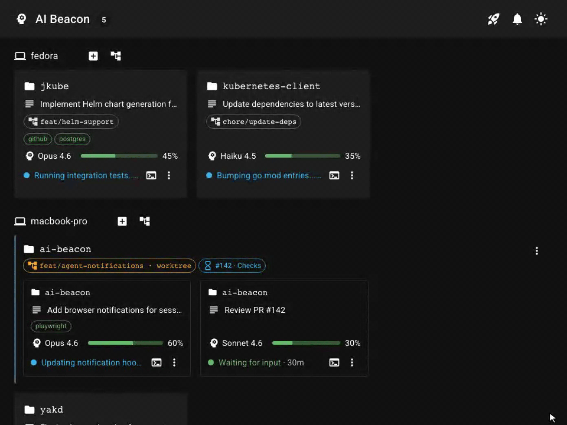

# AI Beacon

Watch every coding agent on every machine — and step in the moment one needs you.



## Why AI Beacon

- **Notice when an agent needs you.** Permission prompts, idle sessions, finished runs — surfaced on one dashboard instead of buried across terminals.
- **Jump in from anywhere.** Attach to any session's terminal from the browser — laptop, phone, another machine — and unblock it without SSHing in.
- **One screen across every machine.** Track model, context usage, cost, branch, and PR status for every Claude Code session you've started, wherever it's running.

→ **[Try it free in ~2 minutes on the OpenShift Developer Sandbox](#deploy-to-openshift-developer-sandbox)**

> [!NOTE]
> **Early access** — binaries, container image, and Helm chart are available now; source will be published after this validation phase. Currently, supports **Claude Code** (more agents planned). Feedback via [issues](https://github.com/manusa/ai-beacon/issues) is the whole point of this phase — please open one.

## Deploy

Pick a deployment method and follow the steps — the built-in setup guide will walk you through connecting your first agent.

| Method | Best for |
|--------|----------|
| [OpenShift Developer Sandbox](#deploy-to-openshift-developer-sandbox) | Free cloud dashboard, no credit card |
| [Any Kubernetes cluster](#deploy-to-any-kubernetes-cluster) | Your own cluster with Helm |
| [Container image](#container-image) | Quick local look without a cluster |
| [Hugging Face Spaces](#deploy-to-hugging-face-spaces) | Free cloud dashboard gated by your Hugging Face account |

## Recommended tools

AI Beacon works out of the box, but most features require these tools on the machines running your agents:

| Tool | What it unlocks |
|------|----------------|
| [`git`](https://git-scm.com/) | Current branch display, worktree management |
| [`gh`](https://cli.github.com/) (authenticated) | PR status and checks on session cards, review and merge PRs from the dashboard |

Without them the dashboard still tracks every session's model, context usage, cost, and duration.

## Deploy to OpenShift Developer Sandbox

The [Developer Sandbox](https://developers.redhat.com/developer-sandbox) is free and available to anyone with a Red Hat account. The same recipe works on any OpenShift cluster.

```bash
# 1. Set the agent token
#    The token authenticates agents to the dashboard. Browser login uses
#    your OpenShift / Red Hat account via the OAuth Proxy sidecar — no
#    password to manage. Only usernames listed in --set allowedUsers can
#    sign in; the snippet below allows your current OpenShift user.
export TOKEN=$(openssl rand -hex 32)

# 2. Install (into your current namespace — the sandbox assigns one for you)
helm install ai-beacon \
  oci://ghcr.io/manusa/charts/ai-beacon \
  --version 0.0.0-snapshot \
  --set openshift=true \
  --set oauthProxy.enabled=true \
  --set persistence.enabled=false \
  --set auth.token="$TOKEN" \
  --set allowedUsers="{$(oc whoami)}"

# 3. Get the dashboard URL
oc get route ai-beacon -o jsonpath='https://{.spec.host}'
```

Open the dashboard URL in your browser. You'll be redirected to OpenShift to log in with your Red Hat account, then asked to authorize the dashboard.
Once inside, click the **rocket icon** in the top bar — the built-in setup guide walks you through downloading the CLI and connecting your first agent.
Then head to [Agent configuration](#agent-configuration) for optional tuning.

> [!NOTE]
> `--version 0.0.0-snapshot` is a rolling pre-release alias that tracks the latest build.
> It is required until a stable release is published.

## Deploy to any Kubernetes cluster

```bash
export TOKEN=$(openssl rand -hex 32)
export PASSWORD=changeme

helm install ai-beacon \
  oci://ghcr.io/manusa/charts/ai-beacon \
  --version 0.0.0-snapshot \
  --set ingress.host=ai-beacon.example.com \
  --set auth.token="$TOKEN" \
  --set auth.password="$PASSWORD" \
  -n ai-beacon --create-namespace
```

On clusters with persistent storage, you can omit `auth.token` and `auth.password` — credentials are auto-generated and persisted to the volume. Retrieve them with:

```bash
kubectl exec -n ai-beacon deploy/ai-beacon -- cat /data/password
kubectl exec -n ai-beacon deploy/ai-beacon -- cat /data/token
```

See [Agent configuration](#agent-configuration) for optional tuning.

## Container image

To try the dashboard locally without a cluster:

```bash
podman volume create ai-beacon
podman run --pull=always \
  -e AI_BEACON_AUTH_PASSWORD=demo \
  -p 8080:8080 \
  -v ai-beacon:/data \
  ghcr.io/manusa/ai-beacon:latest
```

Open <http://localhost:8080> and log in with password **demo**.
The dashboard will be empty until you connect an agent — click the **rocket icon** in the top bar for setup instructions.
Then head to [Agent configuration](#agent-configuration) for optional tuning.

> [!IMPORTANT]
> Mount `/data` to a persistent volume (named volume above, or a bind mount). The agent auth token lives there; without a volume, every container restart regenerates it and silently invalidates the token baked into your installed agent hooks — sessions stop appearing on the dashboard until you re-run `ai-beacon install` with the new token.

## Deploy to Hugging Face Spaces

Hugging Face's free CPU tier accepts arbitrary Docker images and projects the signed-in HF user's identity into the container via OAuth/OIDC — so the dashboard's "who is allowed in" question is answered by your existing Hugging Face account, with no IdP to configure and no password to manage.

The recipe lives in [`huggingface-space/`](huggingface-space/README.md). Push that directory to a fresh Space, set two secrets, restart the Space:

```bash
# 1. Create a new Space (any owner, any name, SDK: Docker) at
#    https://huggingface.co/new-space, then clone its empty repo
git clone https://huggingface.co/spaces/<your-user>/<space-name>
cp huggingface-space/Dockerfile huggingface-space/entrypoint.sh huggingface-space/README.md <space-name>/
cd <space-name> && git add . && git commit -m "Deploy ai-beacon" && git push

# 2. In the Space's Settings → Variables and secrets, add two secrets:
#    AI_BEACON_AUTH_TOKEN       = openssl rand -hex 32  (your agents present this)
#    AI_BEACON_ALLOWED_USERS    = your-hf-username[,other-hf-username,...]
#
# 3. Restart the Space. Open https://<your-user>-<space-name>.hf.space —
#    you'll be redirected to Hugging Face login, then back to the dashboard.
```

See [`huggingface-space/README.md`](huggingface-space/README.md) for the full step-by-step, the free-tier caveats, and the env-var → flag mapping. The auth side is covered in [`docs/auth.md`](docs/auth.md#oidc-bring-your-own-idp).

## Agent configuration

The setup guide covers installing the CLI and connecting to the server.
These additional environment variables are optional but useful:

| Variable | Purpose | Default |
|----------|---------|---------|
| `AI_BEACON_PROJECTS_DIR` | Base directory for your repositories — enables spawning new sessions and worktree workflows from the dashboard | _(disabled)_ |
| `AI_BEACON_DEVICE_NAME` | Friendly name shown in the dashboard for this machine | hostname |

Set them in your shell profile (e.g. `~/.zshrc`) so they apply to every session:

```bash
export AI_BEACON_PROJECTS_DIR=~/projects
export AI_BEACON_DEVICE_NAME=macbook
```

## Documentation

For everything beyond the initial deploy and first session — multi-machine setup, auth modes (OIDC, proxy-header), GitHub integration, workflow prompts, the full configuration surface, and troubleshooting — see [`docs/`](docs/README.md).

## Contributing

[](https://workspaces.openshift.com#https://github.com/manusa/ai-beacon)

## License

[Apache License 2.0](LICENSE)
