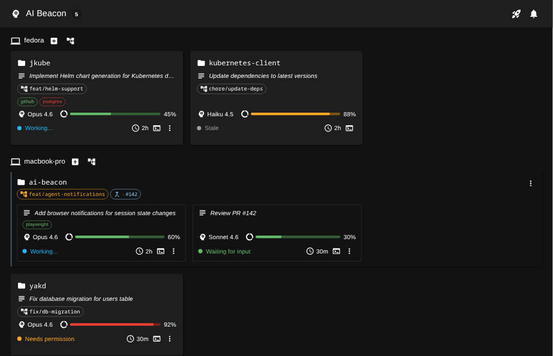

# AI Beacon

A web dashboard for monitoring and managing AI coding agent sessions across your devices.



## Deploy to OpenShift Developer Sandbox

The [Developer Sandbox](https://developers.redhat.com/developer-sandbox) is free and available to anyone with a Red Hat account.

```bash
# 1. Set credentials
#    The token authenticates agents to the server.
#    The password is for browser login — pick something you'll remember.
#    WARNING: don't reuse a real password here; the value is passed on the command line.
export TOKEN=$(openssl rand -hex 32)
export PASSWORD=changeme

# 2. Install (into your current namespace — the sandbox assigns one for you)
helm install ai-beacon \
  oci://ghcr.io/manusa/charts/ai-beacon \
  --version 0.0.0-snapshot \
  --set openshift=true \
  --set persistence.enabled=false \
  --set auth.token="$TOKEN" \
  --set auth.password="$PASSWORD"

# 3. Get the dashboard URL
oc get route ai-beacon -o jsonpath='https://{.spec.host}'
```

Open the dashboard URL in your browser and log in with the password you set above.
Once inside, click the **rocket icon** in the top bar — the built-in setup guide walks you through downloading the CLI and connecting your first agent.

> [!NOTE]
> `--version 0.0.0-snapshot` is a rolling pre-release alias that tracks the latest build.
> It is required until a stable release is published.

## Deploy to any Kubernetes cluster

```bash
export TOKEN=$(openssl rand -hex 32)
export PASSWORD=changeme

helm install ai-beacon \
  oci://ghcr.io/manusa/charts/ai-beacon \
  --version 0.0.0-snapshot \
  --set ingress.host=ai-beacon.example.com \
  --set auth.token="$TOKEN" \
  --set auth.password="$PASSWORD" \
  -n ai-beacon --create-namespace
```

On clusters with persistent storage, you can omit `auth.token` and `auth.password` — credentials are auto-generated and persisted to the volume. Retrieve them with:

```bash
kubectl exec -n ai-beacon deploy/ai-beacon -- cat /data/password
kubectl exec -n ai-beacon deploy/ai-beacon -- cat /data/token
```

## Quick look: container image

To try the dashboard locally without a cluster:

```bash
podman run -p 8080:8080 ghcr.io/manusa/ai-beacon:latest
# open http://localhost:8080
```

## License

[Apache License 2.0](LICENSE)
