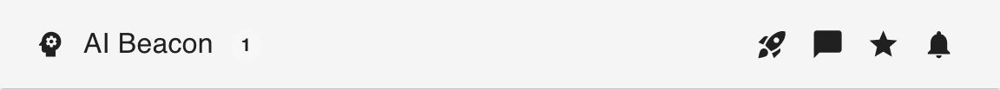

# AI Beacon

<div align="center">

✨ [Features](#features) | 🚀 [Deploy](#deploy) | ⚙️ [Configuration](#agent-configuration) | 📖 [Docs](docs/README.md) | 💬 [Discussions](https://github.com/manusa/ai-beacon/discussions)

</div>

Watch every coding agent on every machine — and step in the moment one needs you.


<div align="center">

<table>
<tr>
<td width="50%" align="center">

### ☁️ Try in the cloud (~2 min, free)

OpenShift Developer Sandbox, no credit card.

**[→ Deploy to the Sandbox](#deploy-to-openshift-developer-sandbox)**

</td>
<td width="50%" align="center">

### 💻 Run locally (~30s, Docker)

One container, one port, one volume.

**[→ Run with Docker](#run-locally-with-docker)**

</td>
</tr>
</table>

</div>

<a id="why-ai-beacon"></a>
## 💡 Why AI Beacon

- **Catch the moment an agent needs you.** Permission prompts, idle sessions, finished runs — paged to you instead of buried across terminals you forgot to check.
- **One view of the whole fleet.** Every session, every machine — model, branch, context, PR — in a single glance.
- **Unblock from anywhere.** Open the dashboard on your phone, attach to the session's terminal, type the answer, walk away.

**Your data stays on your machines. Uninstall is one command.**

*I run my fleet on this every day across 3 machines.* — Marc

<a id="features"></a>
## ✨ Features

1. **Browser terminal** — attach to any session from any device, including your phone.
2. **Push notifications that survive a closed tab** — a service worker keeps you reachable after you've moved on.
3. **Workflow templates** — *Implement Issue* and *Review PR* prime sessions with opinionated, scope-first prompts (TDD, root-cause, multi-persona review) instead of spawning blank shells.
4. **Worktree-aware session spawning** from the browser — start a session on a fresh branch and a fresh worktree in one click.
5. **Real-time multi-machine dashboard** — model, context, cost, branch, PR status per session.
6. **Status detection** — *working* / *idle* / *awaiting permission*, surfaced as the session state.
7. **Pluggable agents** — Claude Code and OpenCode today; plugin SDK in Go for the rest.
8. **Multi-deploy** — native binary, Docker, Helm, OpenShift Sandbox, Hugging Face Spaces.
9. **Auth modes** — PSK, password, OIDC, OAuth Proxy, Hugging Face identity.
10. **Native Linux / macOS / Windows binaries** (amd64 + arm64).

> [!NOTE]
> **Early access** — binaries, container image, and Helm chart are available now; source will be published after this validation phase. Currently supports **Claude Code** and **OpenCode** (more agents planned via the plugin SDK). Feedback via [issues](https://github.com/manusa/ai-beacon/issues) and [discussions](https://github.com/manusa/ai-beacon/discussions) is the whole point of this phase — please open one.
>
> **Support:** Marc responds personally to [Discussions](https://github.com/manusa/ai-beacon/discussions) within 24 hours. Stuck on install? @-mention `@manusa` in the thread for a faster reply.

<a id="deploy"></a>
## 🚀 Deploy

Pick a deployment method and follow the steps — the built-in setup guide will walk you through connecting your first agent.

| Method | Best for |
|--------|----------|
| [OpenShift Developer Sandbox](#deploy-to-openshift-developer-sandbox) | Free cloud dashboard, no credit card |
| [Docker (local)](#run-locally-with-docker) | The fastest way to try the dashboard on your own machine |
| [Any Kubernetes cluster](#deploy-to-any-kubernetes-cluster) | Your own cluster with Helm |
| [Hugging Face Spaces](#deploy-to-hugging-face-spaces) | Free cloud dashboard gated by your Hugging Face account |

Power users can also grab a [native binary](docs/connect-agent.md#native-binaries) directly — Linux, macOS, or Windows.

<a id="deploy-to-openshift-developer-sandbox"></a>
### Deploy to OpenShift Developer Sandbox

The [Developer Sandbox](https://developers.redhat.com/developer-sandbox) is free and available to anyone with a Red Hat account. The same recipe works on any OpenShift cluster.

```bash
# 1. Set the agent token
#    The token authenticates agents to the dashboard. Browser login uses
#    your OpenShift / Red Hat account via the OAuth Proxy sidecar — no
#    password to manage. Only usernames listed in --set allowedUsers can
#    sign in; the snippet below allows your current OpenShift user.
export TOKEN=$(openssl rand -hex 32)

# 2. Install (into your current namespace — the sandbox assigns one for you)
helm install ai-beacon \
  oci://ghcr.io/manusa/charts/ai-beacon \
  --version 0.0.0-snapshot \
  --set openshift=true \
  --set oauthProxy.enabled=true \
  --set persistence.enabled=false \
  --set auth.token="$TOKEN" \
  --set allowedUsers="{$(oc whoami)}"

# 3. Get the dashboard URL
oc get route ai-beacon -o jsonpath='https://{.spec.host}'
```

Open the dashboard URL in your browser. You'll be redirected to OpenShift to log in with your Red Hat account, then asked to authorize the dashboard.

Once inside, click the **rocket icon** in the top bar to open the setup guide:

<div align="center">
  <picture>
    <source media="(prefers-color-scheme: dark)" srcset="docs/assets/app-bar-dark.png">
    
  </picture>
</div>

The guide walks you through downloading the CLI and connecting your first agent. Then head to [Agent configuration](#agent-configuration) for optional tuning.

> [!NOTE]
> `--version 0.0.0-snapshot` is a rolling pre-release alias that tracks the latest build.
> It is required until a stable release is published.

<a id="run-locally-with-docker"></a>
### Run locally with Docker

The fastest way to try the dashboard on your own machine. No cluster, no signup.

> Don't have Docker yet? Install it from [docs.docker.com/get-started](https://docs.docker.com/get-started/get-docker/). If you prefer Podman, replace `docker` with `podman` in every command below — the recipe is identical.

```bash
docker volume create ai-beacon
docker run --pull=always \
  -e AI_BEACON_AUTH_PASSWORD=demo \
  -p 8080:8080 \
  -v ai-beacon:/data \
  ghcr.io/manusa/ai-beacon:latest
```

Open <http://localhost:8080> and log in with password **demo**.

The dashboard will be empty until you connect an agent — click the **rocket icon** in the top bar to open the setup guide:

<div align="center">
  <picture>
    <source media="(prefers-color-scheme: dark)" srcset="docs/assets/app-bar-dark.png">
    
  </picture>
</div>

Then head to [Agent configuration](#agent-configuration) for optional tuning.

> [!IMPORTANT]
> Mount `/data` to a persistent volume (named volume above, or a bind mount). The agent auth token lives there; without a volume, every container restart regenerates it and silently invalidates the token baked into your installed agent hooks — sessions stop appearing on the dashboard until you re-run `ai-beacon install` with the new token.

To inspect the auto-generated agent token from a running container:

```bash
docker exec $(docker ps -qf ancestor=ghcr.io/manusa/ai-beacon) cat /data/token
```

<a id="deploy-to-any-kubernetes-cluster"></a>
### Deploy to any Kubernetes cluster

```bash
export TOKEN=$(openssl rand -hex 32)
export PASSWORD=changeme

helm install ai-beacon \
  oci://ghcr.io/manusa/charts/ai-beacon \
  --version 0.0.0-snapshot \
  --set ingress.host=ai-beacon.example.com \
  --set auth.token="$TOKEN" \
  --set auth.password="$PASSWORD" \
  -n ai-beacon --create-namespace
```

On clusters with persistent storage, you can omit `auth.token` and `auth.password` — credentials are auto-generated and persisted to the volume. Retrieve them with:

```bash
kubectl exec -n ai-beacon deploy/ai-beacon -- cat /data/password
kubectl exec -n ai-beacon deploy/ai-beacon -- cat /data/token
```

See [Agent configuration](#agent-configuration) for optional tuning.

<a id="deploy-to-hugging-face-spaces"></a>
### Deploy to Hugging Face Spaces

Hugging Face's free CPU tier accepts arbitrary Docker images and projects the signed-in HF user's identity into the container via OAuth/OIDC — so the dashboard's "who is allowed in" question is answered by your existing Hugging Face account, with no IdP to configure and no password to manage.

The full recipe lives in [`huggingface-space/`](huggingface-space/README.md): push that directory to a fresh Space, set two secrets, restart the Space. The auth side is covered in [`docs/auth.md`](docs/auth.md#oidc-bring-your-own-idp).

<a id="recommended-tools"></a>
## 🛠️ Recommended tools

AI Beacon works out of the box, but most features require these tools on the machines running your agents:

| Tool | What it unlocks |
|------|----------------|
| [`git`](https://git-scm.com/) | Current branch display, worktree management |
| [`gh`](https://cli.github.com/) (authenticated) | PR status and checks on session cards, review and merge PRs from the dashboard |

Without them the dashboard still tracks every session's model, context usage, cost, and duration.

<a id="agent-configuration"></a>
## ⚙️ Agent configuration

The setup guide covers installing the CLI and connecting to the server.
These additional environment variables are optional but useful:

| Variable | Purpose | Default |
|----------|---------|---------|
| `AI_BEACON_PROJECTS_DIR` | Base directories for your repositories — enables spawning new sessions and worktree workflows from the dashboard. Accepts one path or a list joined by the OS path separator (`:` on Unix, `;` on Windows) | _(disabled)_ |
| `AI_BEACON_DEVICE_NAME` | Friendly name shown in the dashboard for this machine | hostname |

Set them in your shell profile (e.g. `~/.zshrc`) so they apply to every session:

```bash
export AI_BEACON_PROJECTS_DIR=~/projects
export AI_BEACON_DEVICE_NAME=macbook
```

Every other knob — server flags, Helm values, the `config.toml` file, data-directory layout — lives in [`docs/configuration.md`](docs/configuration.md).

<a id="documentation"></a>
## 📖 Documentation

For everything beyond the initial deploy and first session — multi-machine setup, auth modes (OIDC, proxy-header), GitHub integration, workflow prompts, the full configuration surface, and troubleshooting — see [`docs/`](docs/README.md).

<a id="contributing"></a>
## 🤝 Contributing

[](https://workspaces.openshift.com#https://github.com/manusa/ai-beacon)

<a id="license"></a>
## 📜 License

[Apache License 2.0](LICENSE)
